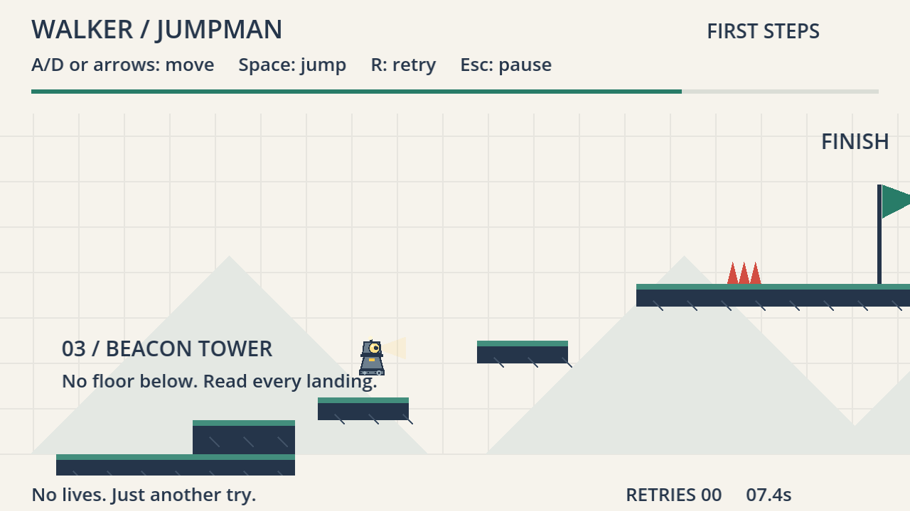
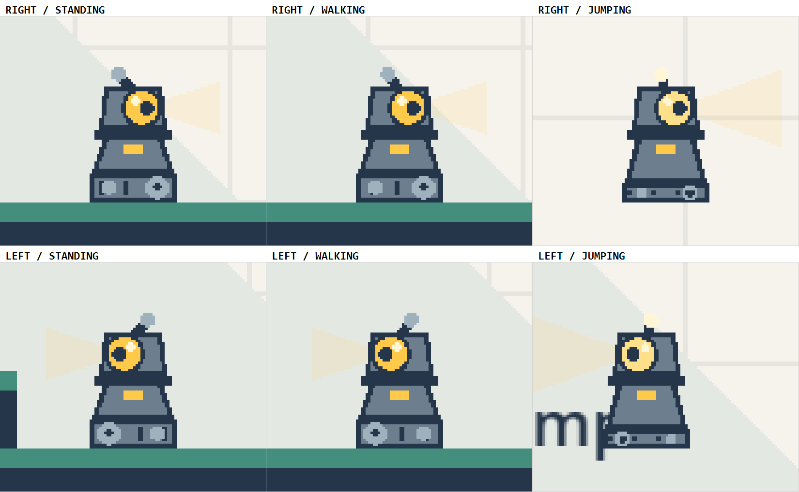
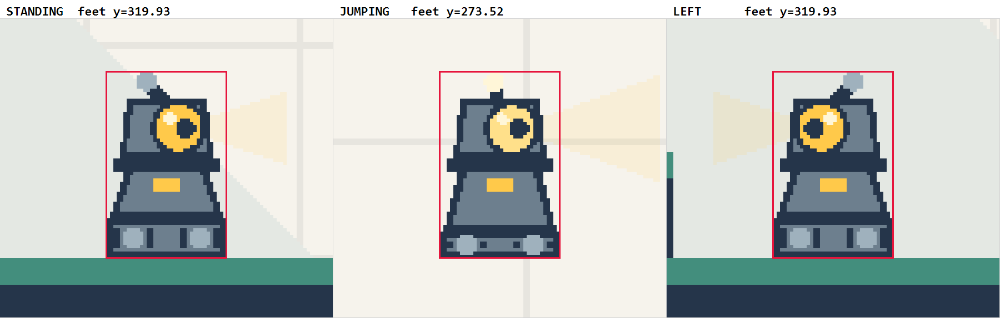

# walker-jumpman-rui-sun

**CSYE 7270, Fall 2026 — Assignment 1: Extend Walker Jumpman**
Rui Sun · Godot 4.7.2 / GDScript · Windows 11

An extension of the **walker-jumpman "First Steps"** starter, not a new project. It gives the
character a new visual identity — **BEACON**, a one-eyed lighthouse robot — and adds a playable
section, the **Beacon Tower**, that the player must complete to reach the relocated finish.



*Beacon between step one and step two of the tower. There is no floor under either.*

---

## Starter credit

Built on **[nikbearbrown/walker-jumpman](https://github.com/nikbearbrown/walker-jumpman)** by
Nik Bear Brown. That repository has no LICENSE file; this is coursework produced under the
Assignment 1 instruction to begin from that starter, not a redistribution claim.

**The unmodified starter is commit `bcde8bc` of this repository.** Everything I changed is
therefore exactly `git diff bcde8bc..HEAD`. The starter's original README and its whole design
package are preserved at that commit, and its design documents (`GDD.md`, `GAME-BRIEF.md`,
`LEVEL-DESIGN.md`, `ASSET-PLAN.md`, `PLAYTEST-PLAN.md`, `PRODUCTION-PLAN.md`, `BUILD-REPORT.md`,
`DESIGN-REVIEW.md`, `DESIGN-STATUS.json`) are still in this tree, unedited and not mine.

Full attribution, including which design ideas are the starter author's, is in
[SOURCES.md](SOURCES.md).

---

## Run it

Requires **Godot 4.7.2**. The tested build is `4.7.2.stable.official.ed1daf0bf`, which is the
same build the starter names — verify with `godot --version`.

**In the editor:** import `godot/project.godot` and press Play.

**From the command line**, from the repository root:

```bash
godot --path godot
```

No .NET runtime, no external assets, no build step. On Windows the portable download is
`Godot_v4.7.2-stable_win64.exe`; use `Godot_v4.7.2-stable_win64_console.exe` when you want
stdout, for example when running the tests below.

### Controls

| Key | Action |
| --- | --- |
| `Enter` | Start · resume · play again |
| `A` / `D` or `←` / `→` | Move |
| `Space` | Jump — one fixed-height jump, no double jump |
| `R` | Retry the attempt |
| `Esc` / `P` | Pause |
| `M` | Main menu, from pause or the results screen |

Retries are unlimited. Reach the flag on the summit.

---

## What I changed

### BEACON — a new character

`godot/features/player/player.gd` `_draw()`. The starter drew a blue-shirted blocky humanoid with
seven `draw_rect` calls. BEACON is a tapered lighthouse robot: legs replaced by a tracked base,
the head is a lamp housing holding one large amber eye, and the outline goes from a rectangle to
a trapezoid. Facing reads from the eye offset, the pupil, the antenna lean, the projected light
cone, and the drive sprocket — which is drawn larger than the trailing idler, so direction is
legible **while standing still**. Airborne reads from tucked tracks, a brighter lamp, an upright
antenna and a wider cone.

All original Godot vector drawing. **No sprite sheet, no imported image, no generated art.**

`tuning.gd` and the 18×28 collider are **untouched**. Every opaque part of Beacon is drawn inside
that collider box; the only thing that leaves it is the translucent light cone. See
`evidence/screens/character/SHEET-collider-check.png`, which draws the real collider over the art.

| Six states | Collider alignment |
| --- | --- |
|  |  |

### Beacon Tower — the level extension

Level width 960 → 1664. The original route from spawn to x = 960 is unchanged and still playable.

| Element | Rect | |
| --- | --- | --- |
| Approach ground | `[1008, 320, 168, 64]` | 48 px gap from the original course |
| Pedestal | `[1104, 296, 72, 24]` | new landing 1 |
| Step one | `[1192, 280, 64, 16]` | new landing 2, nothing below |
| Step two | `[1304, 240, 64, 16]` | new landing 3, nothing below |
| Summit | `[1416, 200, 248, 16]` | new landing 4 |
| Beacon gate | hazard `[1480, 184, 24, 16]` | spikes between the last landing and the flag |
| Finish | `[1584, 144, 24, 56]` | moved from `[916, 264, 24, 56]` |

Four new landings that require jumps; the assignment asks for two. The chasm from x 1176 to 1416
has no floor and **cannot be crossed at ground level** — 0 of 40 measured ground take-offs reach
the far side — so the tower actually gates the finish.

### Drawing made data-driven

`godot/game/session.gd` `_draw()`. The starter drew the grid to a literal `961`, the hills to a
literal `[100, 470, 770]`, every spike between the literals `320` and `304`, and the finish pole
between `320` and `250`. Under that code the summit spikes would have been painted on the ground
while their triggers sat 136 px higher, and the flag would have floated at the old ground line.
Hazard drawing now mirrors `_add_area()` parameter for parameter. Labels and hill positions moved
into the level JSON.

`godot/ui/hud.gd` divided progress by a literal `852`; it now computes the span from level data,
so the bar no longer fills at the halfway point.

### Two declared behaviour changes

Both were written into [CHANGE-BRIEF.md](CHANGE-BRIEF.md) §5 **before** any code was edited, each
with its own check.

- **Facing-aware eased camera.** The constant `+100` snap becomes a facing-aware `±80` eased
  toward its target. `camera.y` stays fixed on purpose.
- **Death feedback.** On death the light cone goes out, the eye drops to a flickering dim red,
  the mast snaps, the hull darkens, and the hazard that killed you flashes. **Drawing state
  only** — no timing, physics or collision value changes, and nothing moves the silhouette.

---

## Tests

```bash
godot --headless --path godot --script res://tests/test_game.gd       # 29 checks / 0 failures
godot --headless --path godot --script res://tests/test_keyboard.gd   #  9 checks / 0 failures
godot --headless --path godot --script res://tests/verify_reach.gd    #  9 jumps  / 0 failures
```

Capture scripts must run **without** `--headless`:

```bash
godot --path godot --script res://tests/capture_game.gd
godot --path godot --script res://tests/capture_character.gd
powershell -ExecutionPolicy Bypass -File scripts/make-character-sheet.ps1
```

All 25 of the starter's mechanics checks and all 9 keyboard checks are present, unmodified, and
passing. **No assertion was deleted or weakened.** Four were added for the declared changes.

`tests/verify_reach.gd` is new: it sweeps the take-off x of the real player in 2 px steps and
reports the window that actually lands. It reads **no value from `tuning.gd`**, so a level that
only passes because the jump was strengthened cannot pass it. Measured windows are 54–86 px.

Results, the full human playtest log, and the two reachability runs that genuinely failed are in
[TEST-REPORT.md](TEST-REPORT.md).

---

## Known limitations

1. **The camera still goes static near the summit.** The clamp pins it at `width − 320 = 1344`,
   reached at player x ≈ 1264, so roughly the last 320 px of the climb is a static shot. Correct
   behaviour — the alternative frames space outside the level — but the original complaint is
   only partly addressed.
2. **The camera never moves vertically**, which caps how tall the level may ever get.
3. **The extension is challenge-led, not choice-led.** The brief promised two converging routes;
   that is geometrically impossible at this tuning and [CHANGE-BRIEF.md](CHANGE-BRIEF.md) R1
   shows why. The starter's own unimplemented `MECH-03` optional cherries would supply the
   missing decision; they are not implemented.
4. **One playtester.** Only the author has played it.
5. **The route fixture cannot stop or reverse.** It proves a route exists, not that a person can
   repeat it.
6. **No export was built or tested.** Source only.
7. **The route/failure/replay pass on the newest revision has not been hand-verified** — see
   TEST-REPORT §3 session 5, marked PENDING rather than filled in from memory.

---

## Documents

| File | What it is |
| --- | --- |
| [CHANGE-BRIEF.md](CHANGE-BRIEF.md) | Predictions written before any code, append-only, with revisions R1–R6 |
| [TEST-REPORT.md](TEST-REPORT.md) | Automated results, baseline comparison, human playtest log, limitations |
| [FRICTIONAL.md](FRICTIONAL.md) | Honest log — what I tried, what surprised me, what I rejected |
| [SOURCES.md](SOURCES.md) | Starter credit, tools, and the human/AI split |

## Final film

**Not yet produced.** This section will carry the film URL, filename, and SHA-256 checksum, and
will name the exact game-source revision demonstrated. MP4 files are excluded from this
repository by `.gitignore` and will live in the course media storage.

---

## Commit history

| Commit | |
| --- | --- |
| `bcde8bc` | Unmodified starter |
| `be3c32f` | Baseline test results on my machine, before any edits |
| `c001f07` | CHANGE-BRIEF, written before touching gameplay code |
| `522e6d1` | BEACON character |
| `c2f2e50` | Beacon Tower and data-driven drawing |
| `3d7d43f` | First human playtest acted on |
| `9261070` | Death feedback and facing-aware camera |
